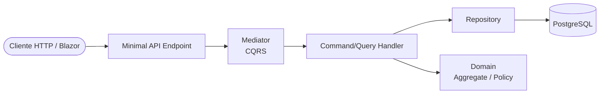

# Good Hamburger

Sistema de pedidos para a lanchonete **Good Hamburger** — permite montar e gerenciar pedidos com regras de desconto automáticas.

## Pré-requisitos

- [.NET 9 SDK](https://dotnet.microsoft.com/download/dotnet/9.0)
- [Docker Desktop](https://www.docker.com/products/docker-desktop/) (opcional, recomendado)
- [Git](https://git-scm.com/)

## Start — Como Executar o Projeto

### 1. Clonar o repositório

```bash
git clone <url-do-repositorio>
cd GoodHamburger
```

### 2. Executar com Docker (recomendado)

Sobe PostgreSQL, API e Blazor Web em um único comando:

```bash
docker compose up --build
```

Para rodar em segundo plano (detached):

```bash
docker compose up --build -d
```

Serviços expostos:

| Serviço | URL | Descrição |
|---------|-----|-----------|
| API + Swagger | http://localhost:8080/swagger | Documentação interativa da API |
| Blazor Web | http://localhost:5001 | Interface do usuário |
| PostgreSQL | `localhost:5432` | Banco de dados (user: `app` / pass: `app`) |

Para parar os containers:

```bash
docker compose down
```

Para remover também o volume do banco (reset completo):

```bash
docker compose down -v
```

### 3. Executar localmente (sem Docker)

#### 3.1. Subir apenas o PostgreSQL via Docker

```bash
docker compose up postgres -d
```

#### 3.2. Restaurar dependências e compilar

```bash
dotnet restore
dotnet build
```

#### 3.3. Rodar a API

```bash
dotnet run --project src/GoodHamburger.Api
```

Acesse: http://localhost:5122/swagger

#### 3.4. Rodar o Blazor Web (em outro terminal)

```bash
dotnet run --project src/GoodHamburger.Web
```

Acesse: http://localhost:5271

> As migrations são aplicadas automaticamente na inicialização da API, e o cardápio é populado via seeder.

### 4. Executar os testes

Rodar toda a suíte:

```bash
dotnet test
```

Rodar com cobertura de código:

```bash
dotnet test --collect:"XPlat Code Coverage"
```

Rodar apenas um projeto de testes específico:

```bash
dotnet test tests/GoodHamburger.Application.Tests
dotnet test tests/GoodHamburger.Domain.Tests
dotnet test tests/GoodHamburger.Api.Tests
dotnet test tests/GoodHamburger.Infrastructure.Tests
```

## Endpoints da API

| Método | Rota | Descrição |
|--------|------|-----------|
| `GET` | `/api/menu` | Retorna o cardápio completo (5 itens) |
| `POST` | `/api/orders` | Cria um novo pedido |
| `GET` | `/api/orders` | Lista pedidos (paginado: `?page=1&pageSize=20`) |
| `GET` | `/api/orders/{id}` | Retorna pedido por ID |
| `PUT` | `/api/orders/{id}` | Atualiza pedido existente |
| `DELETE` | `/api/orders/{id}` | Remove pedido |

### Exemplo de pedido completo

```json
POST /api/orders
{
  "menuItemIds": ["<id-xbacon>", "<id-batata>", "<id-refrigerante>"]
}
```

**Resposta:**
```json
{
  "total": 9.20,
  "discountPercent": 20,
  "discountAmount": 2.30,
  "subtotal": 11.50
}
```

## Regras de desconto

| Combinação | Desconto |
|-----------|---------|
| Sanduíche + Batata + Refrigerante | 20% |
| Sanduíche + Refrigerante | 15% |
| Sanduíche + Batata | 10% |
| Outra combinação | 0% |

## Arquitetura



### Camadas

- **Domain** — Entidades, enums, exceções, política de desconto. Sem dependências externas.
- **Application** — Commands/Queries (CQRS via Mediator), DTOs, validators (FluentValidation), pipeline behavior.
- **Infrastructure** — EF Core Code First + Npgsql, repositórios, Unit of Work, seeder.
- **Api** — Minimal APIs, Swashbuckle (Swagger), Serilog, middleware de exceções.
- **Web** — Blazor Server com formulário de pedido em tempo real.

## O que ficou fora do escopo

- Autenticação e autorização
- Soft delete
- Cache distribuído
- Rate limiting
- Internacionalização (i18n)
- Testes de carga/performance
